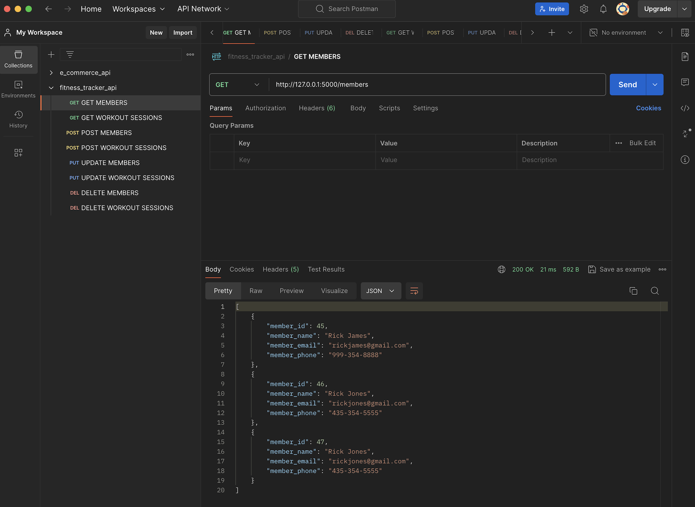
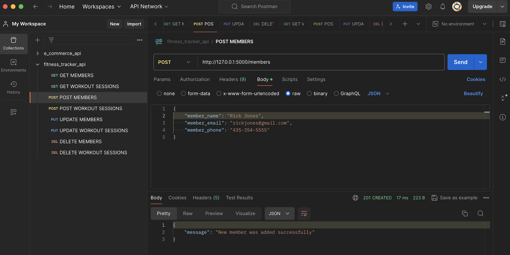
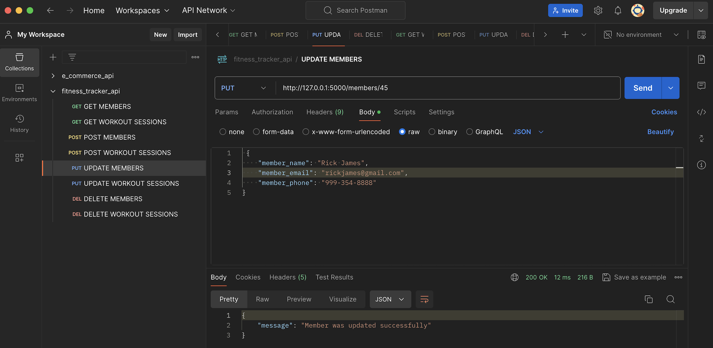
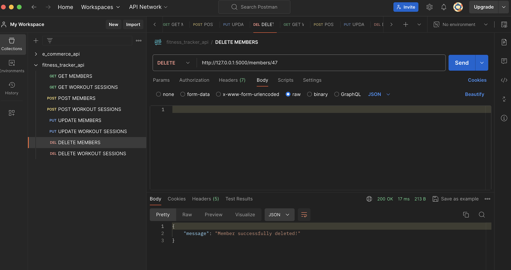
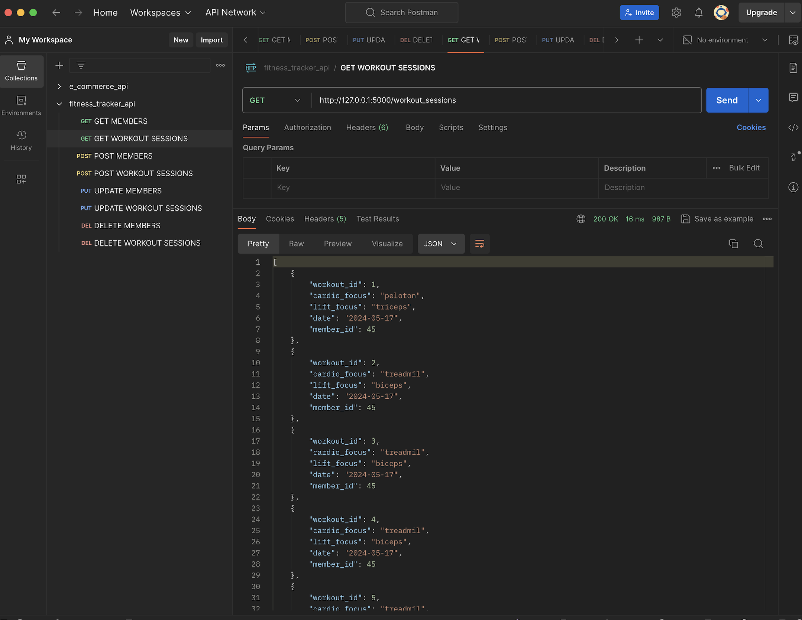
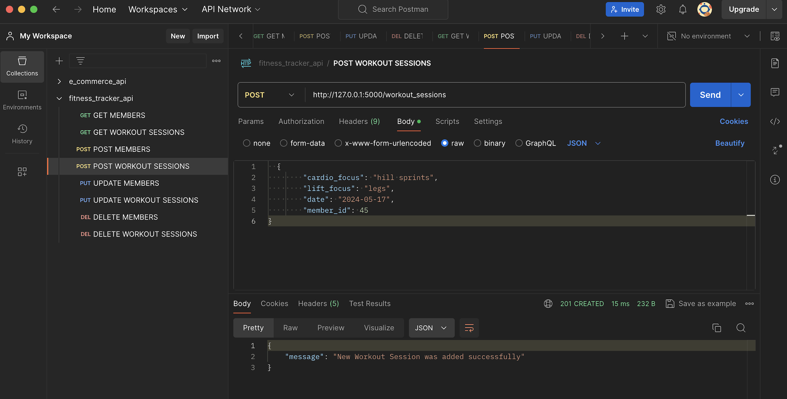
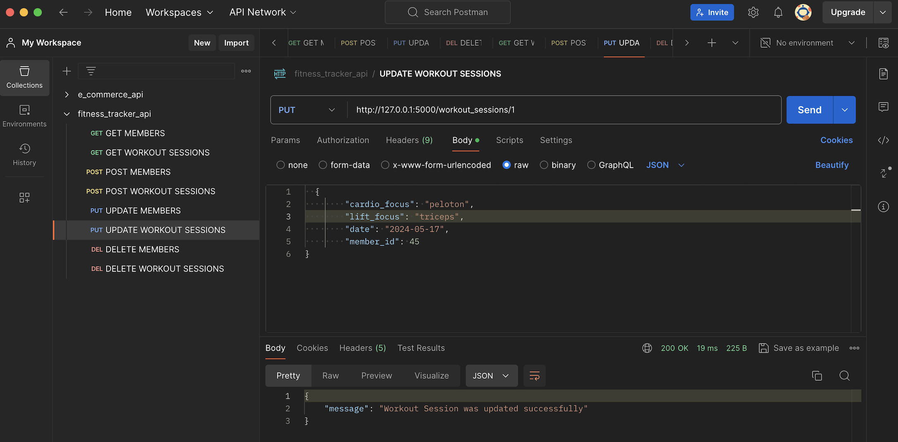
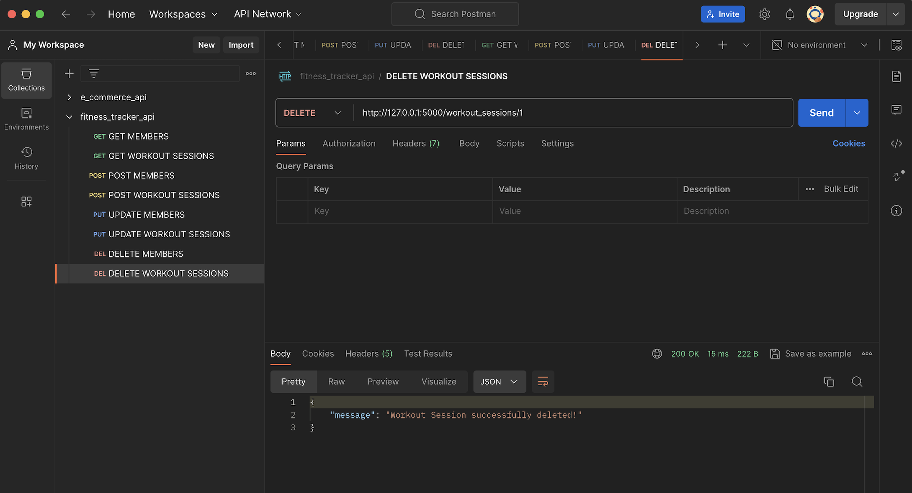

# Screenshots of Flask Routes in Postman

## MEMBERS ROUTES

# GET MEMBERS

# POST MEMBERS

# PUT MEMBERS

# DELETE MEMBERS

## WORKOUT SESSIONS ROUTES

# GET WORKOUT SESSIONS

# POST WORKOUT SESSIONS

# PUT WORKOUT SESSIONS

# DELETE WORKOUT SESSIONS

